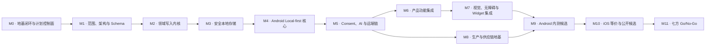
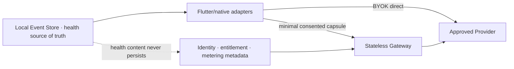

<!-- GENERATED by tool/plan_ops.dart. DO NOT EDIT. -->
# YunMom engineering project map

- Program version: `1.0.0`
- Current stage: `M1`
- Release: `RELEASE_NOT_APPROVED`
- Visual input: revision `2`, gate `G1_YUNMOM_MASTER`, status `not_approved`

## Stage dependency graph

## Execution frontier

| Work item | Stage | Status | Title | Dependencies | External gates |
|---|---|---|---|---|---|
| `M0-WP01` | `M0` | `done` | 项目存储护栏与离线 Strict CI | — | — |
| `M0-WP02` | `M0` | `done` | 工程规划 SSOT、依赖图与追踪矩阵 | M0-WP01 | — |
| `M0-WP03` | `M0` | `done` | GitHub 私有远端与恢复验证 | M0-WP02 | — |
| `M1-WP01` | `M1` | `verification_pending` | V1 Scope 四列表与治理合同 | M0-WP03 | — |
| `M1-WP02` | `M1` | `planned` | Episode、用户、家庭与数据分类合同 | M1-WP01 | LEGAL/SEC 架构审阅 |
| `M1-WP03` | `M1` | `planned` | Consent、Provider 与出站信任边界 | M1-WP01 | LEGAL/SEC Provider 准入 |
| `M1-WP04` | `M1` | `planned` | Event/Command/Receipt Schema Registry v0 | M1-WP02 | — |
| `M2-WP01` | `M2` | `planned` | CreateEpisode 领域纵向切片 | M1-WP04 | — |
| `M3-WP01` | `M3` | `planned` | Crypto、Delete、Backup 与 Archive 内核 | M2-WP01 | SEC Crypto Profile 审阅 |
| `M4-WP01` | `M4` | `planned` | Android Local-first 与确定性 Safety 框架 | M3-WP01 | MD Rule/Golden 批准 |
| `M5-WP01` | `M5` | `planned` | Consent、Queue、Gateway 与计量幂等 | M4-WP01 M1-WP03 | Provider/地域/合同白名单 |
| `M6-WP01` | `M6` | `planned` | Phase 1–6 产品功能闭环 | M5-WP01 | 对应医疗、法律、安全能力批准 |
| `M7-WP01` | `M7` | `planned` | 视觉 Token、无障碍与 Widget 集成 | M6-WP01 | Visual G1/G3/G4+ implementation_ready Token |
| `M8-WP01` | `M8` | `planned` | 生产拓扑、供应链与事故响应 | M5-WP01 | 云资源、值班与专业域批准 |
| `M9-WP01` | `M9` | `planned` | Android 内测矩阵与量化出口 | M7-WP01 M8-WP01 | 最低档和上档 Android 设备资源 |
| `M10-WP01` | `M10` | `planned` | iOS 等价、渗透与公开候选 | M9-WP01 | macOS/Xcode/iOS 真机 独立渗透供应商 |
| `M11-WP01` | `M11` | `planned` | 七方同构建 Go/No-Go | M10-WP01 | 七方专业签字 |

## Trust and workstream boundaries

## Path ownership

| Stream | Paths |
|---|---|
| `engineering` | docs/planning/** docs/engineering/** packages/yunmom_contracts/** packages/yunmom_domain/** tool/** |
| `visual` | visual/** .agents/skills/yunmom-art-director/** packages/yunmom_design_system/** |
| `shared_single_writer` | apps/yunmom_app/** README.md pubspec.yaml pubspec.lock .gitignore tool/run_ci.ps1 tool/run_ci.sh |
